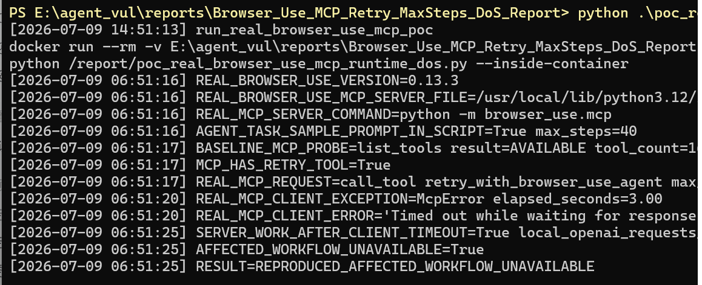

# browser-use has a denial of service vulnerability in the MCP retry agent workflow

## supplier

https://github.com/browser-use/browser-use

## affected version

browser-use 0.13.3

Local source snapshot 0.13.4 contains the same vulnerable code path.

## Vulnerability file

```text
browser_use/mcp/server.py
browser_use/agent/service.py
```

## describe

browser-use has a denial of service vulnerability in the MCP `retry_with_browser_use_agent` workflow.

The MCP server exposes `retry_with_browser_use_agent` as a normal tool. The tool accepts a client-controlled `max_steps` value, but the tool schema does not define a maximum and the server does not clamp the value before creating a child `Agent`.

A normal MCP client, or an upstream agent influenced by prompt injection, can therefore turn one tool call into a long child-agent execution. During that execution, the MCP workflow remains busy and can become unavailable within a normal client deadline.

## code analysis

The MCP tool schema exposes `max_steps` without a maximum:

```python
'max_steps': {
    'type': 'integer',
    'description': 'Maximum number of steps an agent can take.',
    'default': 100,
},
```

The dispatcher forwards the client-controlled value:

```python
if tool_name == 'retry_with_browser_use_agent':
    return await self._retry_with_browser_use_agent(
        task=arguments['task'],
        max_steps=arguments.get('max_steps', 100),
        model=arguments.get('model'),
        allowed_domains=arguments.get('allowed_domains'),
        use_vision=arguments.get('use_vision', True),
    )
```

The helper creates a child agent and runs it with the same value:

```python
agent = Agent(
    task=task,
    llm=llm,
    browser_profile=profile,
    use_vision=use_vision,
)

history = await agent.run(max_steps=max_steps)
```

## PoC

The following PoC starts the real browser-use MCP server with `python -m browser_use.mcp`, connects through MCP stdio, and calls the real `retry_with_browser_use_agent` tool. It uses a local fake OpenAI endpoint only to avoid external provider cost.

The agent prompt is included in the script as `AGENT_TASK_SAMPLE_PROMPT`. The PoC uses the MCP SDK request timeout and records the real MCP client error.

PoC file:

```text
poc_real_browser_use_mcp_runtime_dos.py
```

Run:

```bash
python poc_real_browser_use_mcp_runtime_dos.py
```

MCP timeout output:

```text
[2026-07-09 06:51:16] REAL_MCP_SERVER_COMMAND=python -m browser_use.mcp
[2026-07-09 06:51:16] AGENT_TASK_SAMPLE_PROMPT_IN_SCRIPT=True max_steps=40
[2026-07-09 06:51:17] BASELINE_MCP_PROBE=list_tools result=AVAILABLE tool_count=16
[2026-07-09 06:51:17] MCP_HAS_RETRY_TOOL=True
[2026-07-09 06:51:17] REAL_MCP_REQUEST=call_tool retry_with_browser_use_agent max_steps=40 sdk_read_timeout=3s
[2026-07-09 06:51:20] REAL_MCP_CLIENT_EXCEPTION=McpError elapsed_seconds=3.00
[2026-07-09 06:51:20] REAL_MCP_CLIENT_ERROR='Timed out while waiting for response to ClientRequest. Waited 3.0 seconds.'
[2026-07-09 06:51:25] SERVER_WORK_AFTER_CLIENT_TIMEOUT=True local_openai_requests_before=2 after=7
[2026-07-09 06:51:25] AFFECTED_WORKFLOW_UNAVAILABLE=True
[2026-07-09 06:51:25] RESULT=REPRODUCED_AFFECTED_WORKFLOW_UNAVAILABLE
```

Raw command output:

```text
screenshots/browser_use_real_mcp_runtime_direct_output.txt
```

MCP timeout screenshot:



## repair suggestion

1. Add `minimum` and `maximum` to the MCP schema for `max_steps`.
2. Enforce a server-side hard cap before child agent creation.
3. Add a wall-clock deadline around `retry_with_browser_use_agent`.
4. Make child agents inherit a root budget for steps, tool calls, model calls, tokens, and cost.
5. Add per-client and per-session concurrency limits.
6. Cancel the child agent when the MCP client times out or disconnects.
