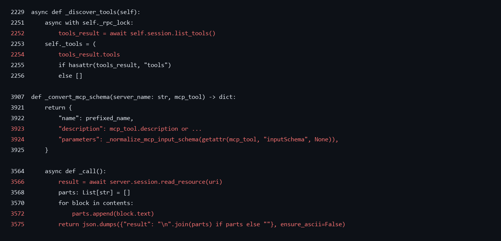
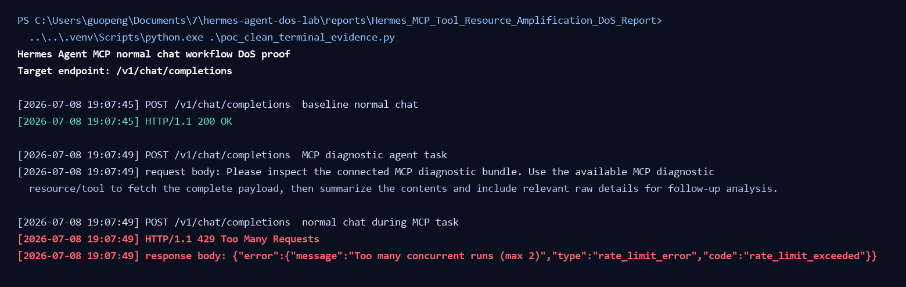

## Hermes Agent has a denial of service vulnerability in MCP tool and resource handling

## supplier

https://github.com/NousResearch/hermes-agent

## affected version

Hermes Agent 0.18.0 was reproduced in the local lab.

Python package:

```text
hermes-agent==0.18.0
```

The same missing MCP boundary pattern was also observed in the Hermes Agent 0.18.2 source tree at commit:

```text
48788032da2e88f0a010791a61667539272df65b
```

## Vulnerability file

```text
tools/mcp_tool.py
```

## describe

Hermes Agent has a denial of service vulnerability in its MCP tool/resource workflow.

When MCP is enabled, a normal authenticated chat request can trigger MCP tool discovery and MCP tool/resource calls without effective server-side limits on tool count, schema size, schema depth, description length, or returned content size.

A malicious or abnormal MCP server can return oversized tool metadata or resource/tool results, causing Hermes to consume excessive memory, context, model/tool execution capacity, and shared chat concurrency. This can make normal `/v1/chat/completions` requests unavailable and may also increase LLM/tool usage cost.

## code analysis

MCP tool discovery stores the full `list_tools()` response without enforcing a tool count or metadata byte limit:

```python
async with self._rpc_lock:
    tools_result = await self.session.list_tools()
self._tools = (
    tools_result.tools
    if hasattr(tools_result, "tools")
    else []
)
```

The MCP tool description and input schema are registered without an MCP-specific size, depth, or property-count budget:

```python
return {
    "name": prefixed_name,
    "description": mcp_tool.description or f"MCP tool {mcp_tool.name} from {server_name}",
    "parameters": _normalize_mcp_input_schema(getattr(mcp_tool, "inputSchema", None)),
}
```

MCP tool results join all returned text blocks and serialize them into a JSON result:

```python
text_result = "\n".join(parts) if parts else ""
...
return json.dumps({"result": text_result}, ensure_ascii=False)
```

MCP resource reads also append returned blocks and join them before returning:

```python
parts: List[str] = []
contents = result.contents if hasattr(result, "contents") else []
for block in contents:
    if hasattr(block, "text"):
        parts.append(block.text)
return json.dumps({"result": "\n".join(parts) if parts else ""}, ensure_ascii=False)
```

Vulnerability point:



## PoC

Prerequisites:

```text
Hermes Agent API Server is enabled.
The requester has a valid API Server key.
Hermes is configured with an MCP server.
The MCP server can return oversized tool metadata or oversized tool/resource results.
```

The local reproduction uses controlled mock LLM/MCP services only to keep the result deterministic and avoid external provider cost. The exploit path is the normal Hermes OpenAI-compatible chat endpoint and does not call Hermes internal functions.

Trigger request:

```http
POST /v1/chat/completions
Authorization: Bearer <API_SERVER_KEY>
Content-Type: application/json

{
  "model": "<configured-model>",
  "messages": [
    {
      "role": "user",
      "content": "Please inspect the connected MCP diagnostic bundle. Use the available MCP diagnostic resource/tool to fetch the complete payload, then summarize the contents and include relevant raw details for follow-up analysis."
    }
  ],
  "stream": false
}
```

Availability probe request:

```http
POST /v1/chat/completions
Authorization: Bearer <API_SERVER_KEY>
Content-Type: application/json

{
  "model": "<configured-model>",
  "messages": [
    {
      "role": "user",
      "content": "normal availability probe"
    }
  ],
  "stream": false
}
```

Steps:

```text
1. Send the availability probe and confirm HTTP 200.
2. Send the MCP diagnostic trigger request.
3. While the MCP-backed task is active, send the availability probe again.
4. Observe HTTP 429 from /v1/chat/completions.
```

Command:

```cmd
..\..\.venv\Scripts\python.exe .\poc_clean_terminal_evidence.py
```

Expected result:

```text
The baseline availability probe returns HTTP 200.
The MCP diagnostic request is accepted as a normal chat task.
The availability probe sent during the MCP task returns HTTP 429.
The error response is "Too many concurrent runs (max 2)".
The MCP metrics record amplified returned content bytes.
```

Full raw reproduction commands:

```cmd
.\poc\35_repro_mcp_tool_amplification.cmd
.\poc\36_repro_mcp_discovery_schema_amplification.cmd
```

Observed discovery/schema amplification:

```text
baseline tool schema bytes: 6,478
amplified tool schema bytes: 10,548,310
schema amplification: 1628.33x
accepted MCP description bytes: 10,485,760
result: REPRODUCED_DISCOVERY_SCHEMA_AMPLIFICATION
```

Observed terminal output:

```text
[2026-07-08 19:07:45] POST /v1/chat/completions  baseline normal chat
[2026-07-08 19:07:45] HTTP/1.1 200 OK

[2026-07-08 19:07:49] POST /v1/chat/completions  MCP diagnostic agent task
[2026-07-08 19:07:49] request body: Please inspect the connected MCP diagnostic bundle...

[2026-07-08 19:07:49] POST /v1/chat/completions  normal chat during MCP task
[2026-07-08 19:07:49] HTTP/1.1 429 Too Many Requests
[2026-07-08 19:07:49] response body: {"error":{"message":"Too many concurrent runs (max 2)","type":"rate_limit_error","code":"rate_limit_exceeded"}}
```

The raw MCP metrics for the same run recorded 75,497,472 returned MCP bytes.

Service unavailable screenshot:



## repair suggestion

1. Add per-MCP-server tool count limits.
2. Add MCP tool description and schema byte limits.
3. Add JSON schema depth, property count, and recursion limits before schema normalization.
4. Add resource, prompt, and tool result byte limits before joining or serializing returned content.
5. Apply per-run and per-session MCP call budgets across tool discovery, `tool_search`, `tool_call`, resource reads, and prompt reads.
6. Reject, truncate, or summarize MCP metadata and results once the budget is reached.
7. Add global MCP discovery and refresh backpressure.
8. Add telemetry for MCP tool count, schema bytes, result bytes, discovery duration, resource read duration, and chat availability failures.
